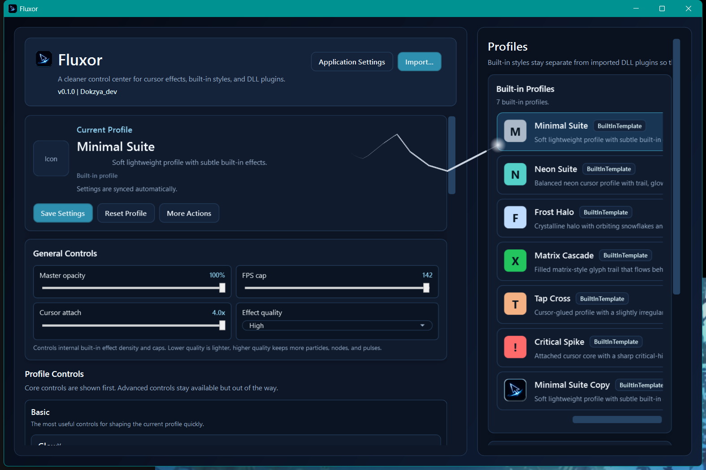
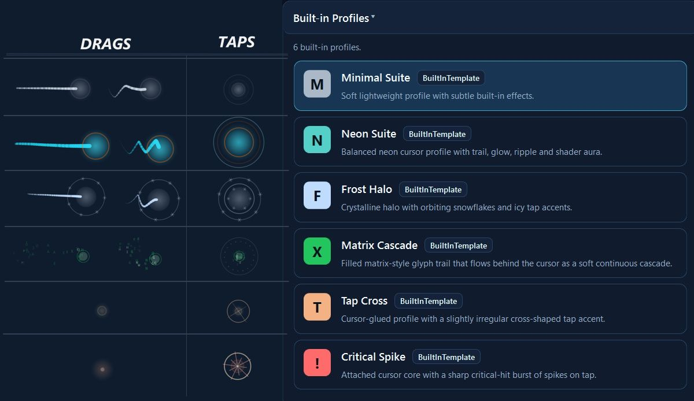
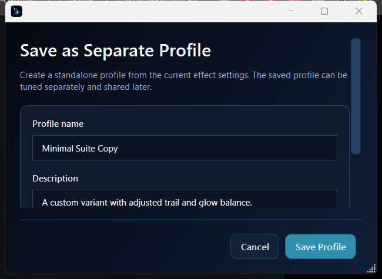
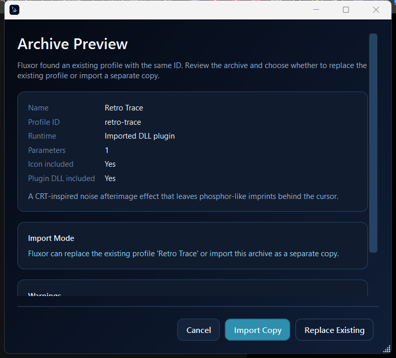
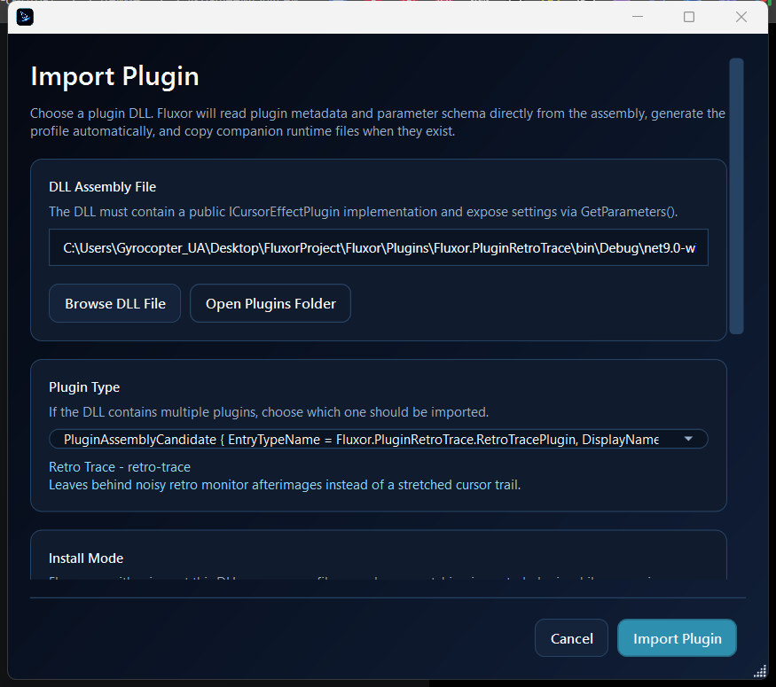
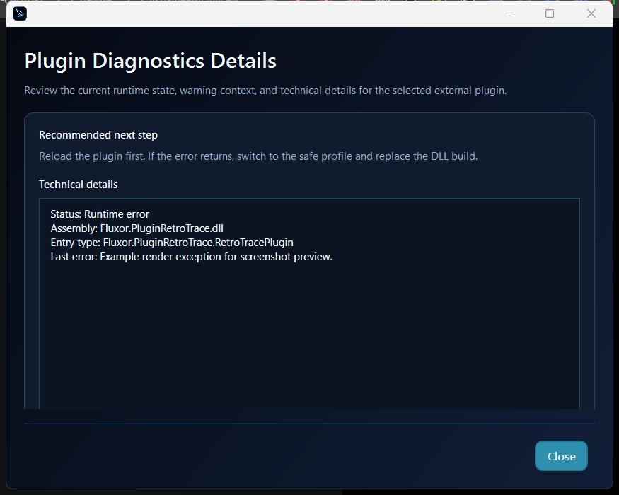
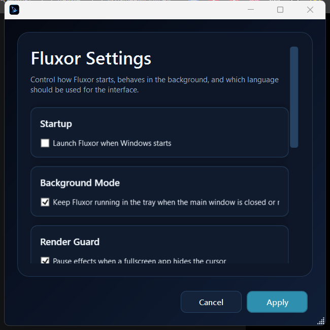
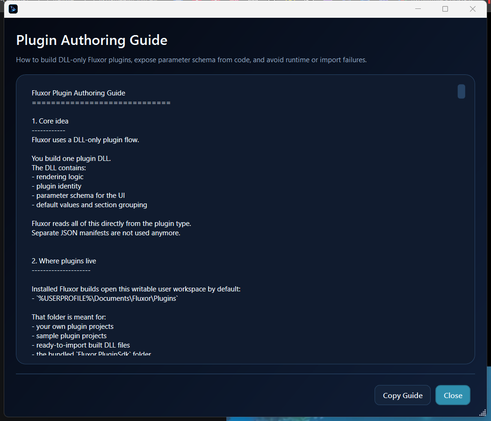
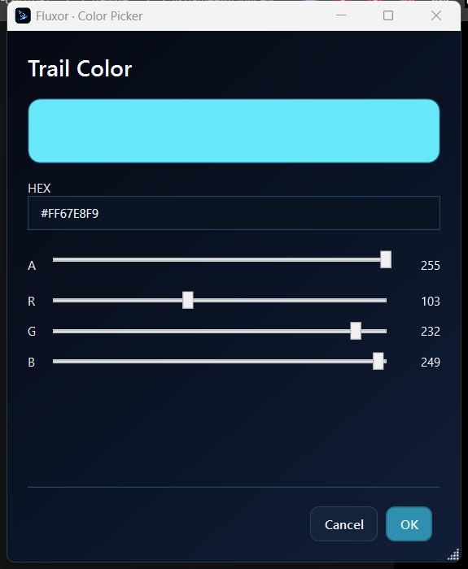

# Fluxor

Fluxor is a Windows desktop app for real-time cursor effects. It lets users apply built-in visual profiles, tune cursor glow and trails, import custom DLL plugins, and share finished profiles as portable `.fluxorprofile` archives.

[Fluxor on itch.io](https://dokzya.itch.io/fluxor)

[Download Fluxor v0.1.1](https://github.com/Vistores/Fluxor/releases/tag/v0.1.1)


## Overview

Fluxor is built around a simple idea: cursor effects should be easy to use, but still open enough for custom rendering logic. Users can start with built-in profiles, adjust parameters live, save their own variants, export profiles, and recover safely if an external plugin breaks.



## Built-in Profiles

Fluxor includes a small curated set of built-in cursor profiles:

- `Minimal Suite` - clean trail and glow for everyday use.
- `Neon Suite` - brighter cyan feedback with a sharper visual feel.
- `Frost Halo` - icy halo accents and colder motion.
- `Matrix Cascade` - digital glyph-style cursor trace.
- `Tap Cross` - click-focused cross accent.
- `Critical Spike` - sharper tap burst with spike-like feedback.



## Profile Workflow

Profiles can be edited and reused without rebuilding effects from scratch. Fluxor supports:

- saving the current setup as a separate profile
- duplicating existing profiles
- renaming saved or imported profiles
- editing profile descriptions
- exporting a complete profile as a `.fluxorprofile`
- importing shared profile archives with preview and conflict handling





## Plugin System

Fluxor supports DLL-only plugins. A plugin implements `ICursorEffectPlugin`, exposes metadata and editable parameters from code, and receives runtime context through `PluginRenderContext`.

Plugin runtime context can include:

- cursor position
- raw screen cursor position
- cursor visibility
- cursor visual snapshot
- backdrop sample
- frame delta time

Included plugin samples:

- `Fluxor.PluginCursorFlameContour`
- `Fluxor.PluginVelvetVoid`
- `Fluxor.PluginFireflySwarm`
- `Fluxor.PluginRetroTrace`


## Diagnostics and Recovery

Fluxor includes diagnostics for external plugins. It can show runtime status, assembly path, entry type, context state, warnings, and next steps. If a plugin is missing or broken, the app can switch back to a safe built-in profile instead of leaving the user stuck.



## Settings and Tools

The app includes settings for startup behavior, language selection, plugin tools, and profile authoring helpers.







## Technologies

- C# and .NET 9
- WPF desktop UI
- Win32 interop for cursor, overlay, and monitor behavior
- Inno Setup for installer packaging
- DLL-based plugin architecture
- GitHub CLI for repository publishing workflow
- Python and WPF helper tooling for screenshot capture and documentation assets

## Project Structure

- `CursorFX.App` - WPF application UI and view models.
- `CursorFX.Core` - shared models, plugin interfaces, profile definitions, and app settings.
- `CursorFX.Effects` - built-in effect runtime.
- `CursorFX.Platform` - platform services and Win32 interop.
- `CursorFX.Rendering` - overlay window and render loop.
- `Plugins` - sample DLL plugin projects.
- `Installer` - Inno Setup packaging script and runtime prerequisite.
- `docs` - release notes, smoke checklist, and screenshots.
- `tools` - screenshot capture utilities.

## Build

Build the app:

```powershell
dotnet build .\CursorFX.App\CursorFX.App.csproj -m:1 -v minimal
```

Run the debug build:

```powershell
.\CursorFX.App\bin\Debug\net9.0-windows\Fluxor.exe
```

Build the installer:

```powershell
powershell -ExecutionPolicy Bypass -File .\build-installer.ps1
```

The installer is created in:

```text
artifacts\installer
```

## Plugin Development

Build a sample plugin:

```powershell
dotnet build .\Plugins\Fluxor.PluginRetroTrace\Fluxor.PluginRetroTrace.csproj -m:1 -v minimal
```

Import the produced DLL through `Import Plugin` in Fluxor.

## Distribution Notes

Fluxor is currently distributed through itch.io:

```text
https://dokzya.itch.io/fluxor
```

Very new unsigned builds may still trigger Windows SmartScreen, Smart App Control, or antivirus reputation warnings. Release builds should be distributed through the installer package.

## Copyright

Copyright (c) 2026 Dokzya_dev. All rights reserved.

This repository is public for portfolio and technology-stack demonstration purposes. The source code, assets, branding, installer scripts, and plugin samples are not open-source unless a separate written license says otherwise. Copying, redistribution, resale, or reuse in another product requires explicit permission from the author.
